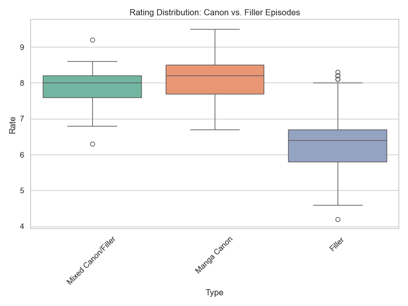
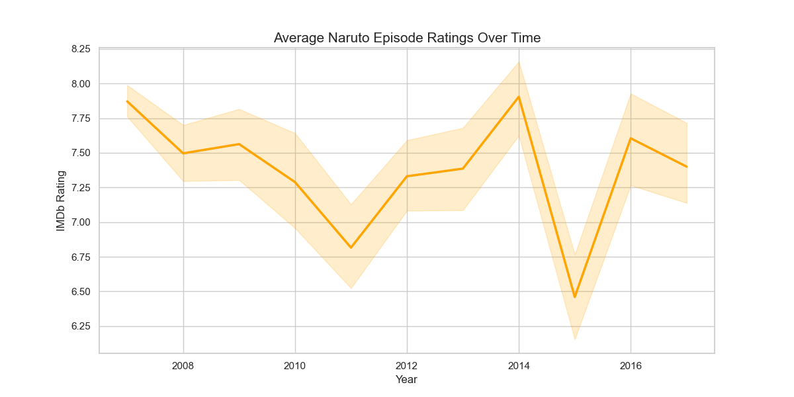
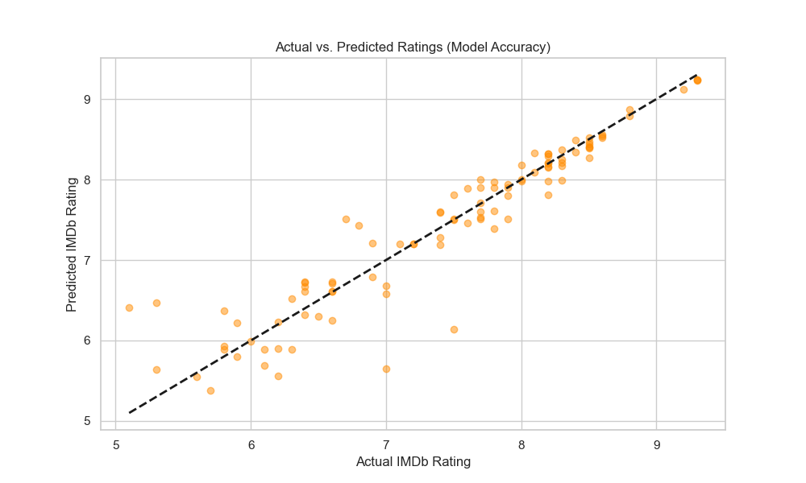

# 🍥 Naruto Episode Success Analytics & Prediction

This project analyzes over 500 episodes of the *Naruto* series to identify the key drivers of viewer satisfaction (IMDb ratings). Using a combination of Exploratory Data Analysis (EDA) and Machine Learning, I built a model that predicts episode ratings with high precision.

---

## 🚀 Key Results
* **Model Performance**: Achieved an **88% R-squared score** and a **Mean Absolute Error (MAE) of 0.21**.
* **Primary Insight**: "Content Type" (Canon vs. Filler) is the #1 predictor of success, accounting for **47%** of the model's decision-making.
* **Engagement**: Community engagement (Votes) proved to be the second most influential factor (41%).

---

## 📊 Visual Insights

### 1. The "Filler" Penalty
Analysis shows a significant drop in ratings for filler content compared to Manga Canon arcs.

### 2. Rating Trends Over Time
Tracking the show's quality and audience reception from its 2007 launch to its 2017 finale.

### 3. Model Accuracy Check (The Proof)
This scatter plot visualizes the relationship between the **Actual IMDb Ratings** and my **Model's Predictions**. The strong linear alignment confirms the 88% accuracy and demonstrates the model's reliability in forecasting episode success.

---

## 🛠️ Tech Stack & Skills
* **Data Wrangling**: Cleaned messy Unicode data and handled time-series formatting using `Pandas`.
* **Visualization**: Developed professional-grade charts using `Seaborn` and `Matplotlib`.
* **Machine Learning**: Implemented a `RandomForestRegressor` with `GridSearchCV` for hyperparameter tuning.
* **Evaluation**: Validated model performance using R-squared and MAE metrics.

---

## 📂 Project Structure
- `naruto_analysis.ipynb`: The complete Python pipeline (Cleaning, EDA, and ML).
- `naruto.csv`: The raw dataset used for the study.
- `final_naruto_episodes_analysis.csv`: The final processed data with engineered features and model predictions.

---

## 💡 Conclusion & Recommendations

Based on the 88% accuracy of the Random Forest model and the feature importance analysis, we can draw the following conclusions:

* **Prioritize Source Material**: Content Type is the strongest predictor of success (47%). Viewer satisfaction is statistically most stable during **Manga Canon** arcs.
* **The "Hype" Effect**: Community engagement (Votes) proved to be the second most influential factor (41%). High-performing sagas aren't just high-quality; they are high-engagement events.
* **Strategy for Producers**: To maintain high IMDb ratings in long-running series, data suggests minimizing non-canon "Filler" arcs or, at minimum, transitioning them into **"Mixed Canon"** to maintain narrative momentum.

---
---
